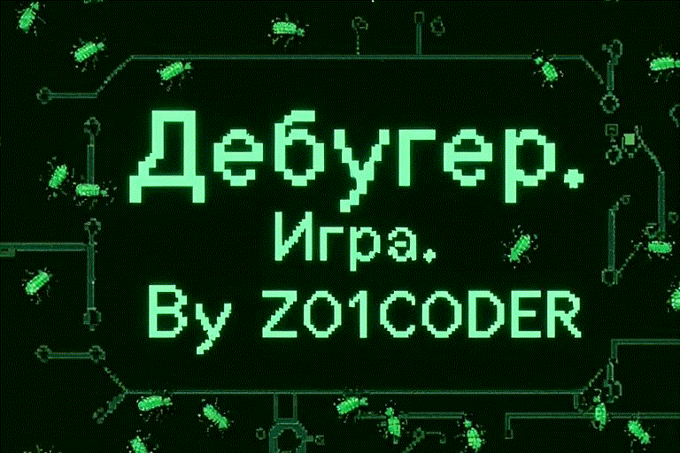

<!-- Improved compatibility of В начало link: See: https://github.com/othneildrew/Best-README-Template/pull/73 -->
<a id="readme-top"></a>


<!-- LANGUAGE SWITCHER -->
<div align="right">
  <strong>Язык:</strong> <a href="README.en.md">English</a> | <a href="README.md">Русский</a>
</div>


<!-- PROJECT SHIELDS -->
<!--
*** I'm using markdown "reference style" links for readability.
*** Reference links are enclosed in brackets [ ] instead of parentheses ( ).
*** See the bottom of this document for the declaration of the reference variables
*** for contributors-url, forks-url, etc. This is an optional, concise syntax you may use.
*** https://www.markdownguide.org/basic-syntax/#reference-style-links
-->


<!-- PROJECT LOGO -->
<br />
<div align="center">
  <h1 align="center">Дебугер</h3>

  <p align="center">
    Аркадная игра на Python с использованием библиотеки Pygame
    <br />
  </p>
</div>

<div align="center">
  
</div>


<!-- TABLE OF CONTENTS -->
<details>
  <summary>Содержание</summary>
  <ol>
    <li>
      <a href="#о-проекте">О проекте</a>
      <ul>
        <li><a href="#используемые-технологии">Используемые технологии</a></li>
      </ul>
    </li>
    <li>
      <a href="#начало-работы">Начало работы</a>
      <ul>
        <li><a href="#требования">Требования</a></li>
        <li><a href="#установка">Установка</a></li>
      </ul>
    </li>
    <li><a href="#использование">Использование</a></li>
    <li><a href="#скриншоты-разработки">Скриншоты разработки</a></li>
    <li><a href="#план-развития">План развития</a></li>
    <li><a href="#вклад-в-проект">Вклад в проект</a></li>
    <li><a href="#лицензия">Лицензия</a></li>
    <li><a href="#контакты">Контакты</a></li>
    <li><a href="#благодарности">Благодарности</a></li>
  </ol>
</details>


<!-- ABOUT THE PROJECT -->
## О проекте

"Дебугер" — это аркадная игра, созданная на Python с использованием библиотеки Pygame. Она представляет собой переработанную версию игры "Тир", вдохновлённую научным мемом о происхождении термина "баг". В этой игре вы выступаете в роли "дебагера", сражающегося с жуками, которые норовят прилипнуть к печатной плате. Цель — устранить как можно больше жуков за ограниченное время.

<details>
  <summary><strong>Цели и задачи проекта</strong></summary>

**Цели:**
* Создать увлекательную аркадную игру с простым геймплеем
* Продемонстрировать возможности библиотеки Pygame для создания игр
* Реализовать игровую механику с таймером и подсчётом очков
* Создать визуально привлекательный интерфейс в ретро-стиле

**Ключевые задачи:**
* Разработать игровой цикл с обработкой событий мыши
* Реализовать систему подсчёта попаданий и отображения статистики
* Создать интро-экран с возможностью перехода к игре
* Интегрировать звуковые эффекты и фоновую музыку
* Реализовать систему случайного появления целей на экране
* Добавить таймер для ограничения времени игры (30 секунд на раунд)
* Создать систему отображения текущего и предыдущего рекорда

</details>

<details>
  <summary><strong>Результаты</strong></summary>

**Реализованная функциональность:**
* Интро-экран с изображением, переход к игре по клику мыши
* Игровой процесс с кликаньем по жукам на печатной плате
* Система подсчёта попаданий в реальном времени
* Таймер игры (30 секунд на раунд)
* Отображение текущего и предыдущего рекорда
* Случайное появление целей в разных местах экрана
* Звуковые эффекты при попадании
* Фоновая музыка во время игры
* Случайная смена цветов фона между раундами

**Созданные компоненты:**
* Основной игровой файл `main.py` с полным игровым циклом
* Система загрузки и отображения изображений (интро, фон, цели)
* Обработка событий мыши для определения попаданий
* Система таймера и управления раундами
* Интеграция звуковых эффектов и музыки через Pygame Mixer

</details>

<p align="right">(<a href="#readme-top">В начало</a>)</p>


### Используемые технологии

Основные технологии и библиотеки, используемые в проекте:

* [![Python][Python-badge]][Python-url]
* [![Pygame][Pygame-badge]][Pygame-url]

Дополнительные зависимости:
* `pygame>=2.0.0` - библиотека для создания игр и мультимедийных приложений

<p align="right">(<a href="#readme-top">В начало</a>)</p>


<!-- GETTING STARTED -->
<details>
  <summary><strong>Начало работы</strong></summary>

Инструкции по установке и запуску игры локально.

### Требования

Для работы с проектом необходимо установить:

* Python 3.x
  ```sh
  # Проверьте версию Python
  python --version
  ```

### Установка

Ниже приведены инструкции по установке и запуску игры.

1. Клонируйте репозиторий
   ```sh
   git clone https://github.com/Z01coder/Debuger-game.git
   cd Debuger-game
   ```

2. Создайте виртуальное окружение (рекомендуется)
   ```sh
   python -m venv venv
   # Windows
   venv\Scripts\activate
   # Linux/Mac
   source venv/bin/activate
   ```

3. Установите зависимости
   ```sh
   pip install -r requirements.txt
   ```

4. Запустите игру
   ```sh
   python main.py
   ```

5. Управление игрой:
   - На интро-экране кликните мышью для начала игры
   - В игре кликайте по жукам, появляющимся на экране
   - Каждое попадание засчитывается как очко
   - Раунд длится 30 секунд, после чего игра перезапускается
   - Ваш предыдущий рекорд сохраняется и отображается в правом верхнем углу

</details>

<p align="right">(<a href="#readme-top">В начало</a>)</p>


<!-- USAGE EXAMPLES -->
<details>
  <summary><strong>Использование</strong></summary>

Игра предоставляет простой и увлекательный геймплей:

### Игровой процесс:

1. **Интро-экран**
   - При запуске игры отображается интро-экран с названием игры
   - Кликните мышью в любом месте экрана, чтобы начать игру

2. **Основной геймплей**
   - На экране появляются жуки (цели) в случайных местах
   - Кликайте по жукам, чтобы заработать очки
   - Каждое попадание сопровождается звуковым эффектом
   - Фоновая музыка играет во время игры

3. **Система подсчёта очков**
   - Текущее количество попаданий отображается в левом верхнем углу
   - Предыдущий рекорд отображается в правом верхнем углу
   - После завершения раунда (30 секунд) текущий результат становится предыдущим рекордом

4. **Особенности:**
   - Жуки появляются в случайных местах экрана после каждого попадания
   - Фон игры меняет цвет случайным образом между раундами
   - Используются различные изображения жуков для разнообразия

</details>

<p align="right">(<a href="#readme-top">В начало</a>)</p>


<!-- DEVELOPMENT SCREENSHOTS -->
<details>
  <summary><strong>Скриншоты разработки</strong></summary>

Ниже представлены скриншоты процесса разработки игры:


</details>

<p align="right">(<a href="#readme-top">В начало</a>)</p>


<!-- ROADMAP -->
## План развития

<details>
  <summary><strong>Показать пройденные этапы разработки</strong></summary>

### Выполненные этапы:

- [x] **Этап 1: Базовая структура проекта**
  - [x] Создание основного файла `main.py`
  - [x] Инициализация Pygame и настройка окна игры
  - [x] Настройка размеров экрана (1280x720)

- [x] **Этап 2: Загрузка ресурсов**
  - [x] Загрузка фонового изображения карты
  - [x] Загрузка интро-изображения
  - [x] Загрузка изображений целей (жуков)
  - [x] Загрузка иконки приложения

- [x] **Этап 3: Интро-экран**
  - [x] Реализация отображения интро-экрана
  - [x] Обработка клика мыши для перехода к игре
  - [x] Обработка закрытия окна на интро-экране

- [x] **Этап 4: Основной игровой цикл**
  - [x] Реализация основного цикла игры
  - [x] Обработка событий закрытия окна
  - [x] Обработка кликов мыши

- [x] **Этап 5: Система попаданий**
  - [x] Определение попадания по цели при клике
  - [x] Подсчёт количества попаданий
  - [x] Перемещение цели в случайное место после попадания
  - [x] Случайный выбор изображения цели

- [x] **Этап 6: Таймер и раунды**
  - [x] Реализация таймера игры (30 секунд)
  - [x] Автоматический перезапуск раунда после истечения времени
  - [x] Сохранение предыдущего рекорда

- [x] **Этап 7: Отображение статистики**
  - [x] Отображение текущего количества попаданий
  - [x] Отображение предыдущего рекорда
  - [x] Настройка шрифта и цвета текста

- [x] **Этап 8: Звуковые эффекты**
  - [x] Интеграция Pygame Mixer для работы со звуком
  - [x] Загрузка и воспроизведение фоновой музыки
  - [x] Добавление звукового эффекта при попадании
  - [x] Настройка громкости звуков

- [x] **Этап 9: Визуальные эффекты**
  - [x] Случайная смена цвета фона между раундами
  - [x] Отображение фонового изображения карты
  - [x] Отображение целей на экране

</details>

### Планируемые улучшения:

- [ ] Добавление системы уровней сложности
- [ ] Реализация таблицы рекордов
- [ ] Добавление различных типов жуков с разными очками
- [ ] Реализация системы бонусов и специальных эффектов
- [ ] Добавление анимаций для жуков
- [ ] Улучшение визуальных эффектов при попадании
- [ ] Добавление меню настроек (громкость, разрешение экрана)
- [ ] Реализация системы достижений
- [ ] Добавление паузы в игре
- [ ] Создание версии для мобильных устройств

<p align="right">(<a href="#readme-top">В начало</a>)</p>


<!-- CONTRIBUTING -->
## Вклад в проект

Вклады делают сообщество открытого исходного кода таким удивительным местом для обучения, вдохновения и творчества. Любые ваши вклады будут **высоко оценены**.

Если у вас есть предложения по улучшению, пожалуйста, создайте fork репозитория и отправьте pull request. Вы также можете просто открыть задачу с тегом «enhancement». Не забудьте поставить проекту звездочку! Еще раз спасибо!

1. Создать fork проекта
2. Создайте ветку для вашей функции (`git checkout -b feature/AmazingFeature`)
3. Зафиксируйте изменения (`git commit -m 'Add some AmazingFeature'`)
4. Отправьте изменения в ветку (`git push origin feature/AmazingFeature`)
5. Создайте Pull Request

<p align="right">(<a href="#readme-top">В начало</a>)</p>


<!-- LICENSE -->
## Лицензия

Распространяется по лицензии MIT. Дополнительную информацию см. в файле `LICENSE`.

<p align="right">(<a href="#readme-top">В начало</a>)</p>


<!-- CONTACT -->
## Контакты

* [![GitHub][GitHub-badge]][GitHub-url]
* [![Gmail][Gmail-badge]][Gmail-url]
* [![Telegram][Telegram-badge]][Telegram-url]

<p align="right">(<a href="#readme-top">В начало</a>)</p>


<!-- ACKNOWLEDGMENTS -->
## Благодарности

Выражаю искреннюю благодарность университету [Zerocoder](https://zerocoder.ru/) и всей его команде за создание вдохновляющей и профессиональной образовательной среды. За подготовку "IT-астронавтов" на "космодроме" Зерокодер.

Особая благодарность:

[Кириллу Пшиннику](https://kpshinnik.ru/), директору университета, за вдохновение на подвиг;

Преподавателям [Нине Стефанцовой](https://neural-courses.ru/teacher/nina-stefancova/), [Максиму Вершинину](https://neural-courses.ru/teacher/maksim-vershinin/) и [Дарье Бобровской](https://neural-courses.ru/teacher/darya-bobrovskaya/) — за глубокие знания, терпение и готовность всегда помочь;

Никите Муркину, куратору курса, за чёткую организацию и наставничество;

Елизавете, менеджеру, за заботу, оперативность и неизменную доброжелательность.

Благодаря вам этот проект стал возможен!

<p align="right">(<a href="#readme-top">В начало</a>)</p>


<!-- GRACE HOPPER -->
<details>
  <summary><strong>Грейс Хоппер</strong></summary>

<div align="center">
  
  <p><strong>Грейс Хоппер</strong></p>
</div>

Грейс Мюррей Хоппер (1906-1992) — американский учёный-компьютерщик и контр-адмирал военно-морского флота США. Она была одним из первых программистов компьютера Harvard Mark I и разработала первый компилятор для компьютерного языка программирования.

Хоппер популяризировала идею машинно-независимых языков программирования, что привело к разработке COBOL, одного из первых языков высокого уровня. Она также известна тем, что нашла первого "бага" (bug) в компьютере — настоящего мотылька, застрявшего в реле компьютера Mark II в 1947 году. Этот инцидент стал источником термина "debugging" (отладка) в программировании.

За свою выдающуюся карьеру Грейс Хоппер получила множество наград и почётных званий, включая Национальную медаль технологий и инноваций США. Она остаётся вдохновляющей фигурой в истории информатики и символом женского лидерства в технологиях.

</details>

<p align="right">(<a href="#readme-top">В начало</a>)</p>


<!-- MARKDOWN LINKS & IMAGES -->
<!-- https://www.markdownguide.org/basic-syntax/#reference-style-links -->
[Python-badge]: https://img.shields.io/badge/Python-3776AB?style=for-the-badge&logo=python&logoColor=white
[Python-url]: https://www.python.org/
[Pygame-badge]: https://img.shields.io/badge/Pygame-FF6F00?style=for-the-badge&logo=pygame&logoColor=white
[Pygame-url]: https://www.pygame.org/
[GitHub-badge]: https://img.shields.io/badge/GitHub-181717?style=for-the-badge&logo=github&logoColor=white
[GitHub-url]: https://github.com/Z01coder
[Gmail-badge]: https://img.shields.io/badge/Gmail-D14836?style=for-the-badge&logo=gmail&logoColor=white
[Gmail-url]: mailto:zolotuxin.alexey@gmail.com
[Telegram-badge]: https://img.shields.io/badge/Telegram-2CA5E0?style=for-the-badge&logo=telegram&logoColor=white
[Telegram-url]: https://t.me/AZVXAN

